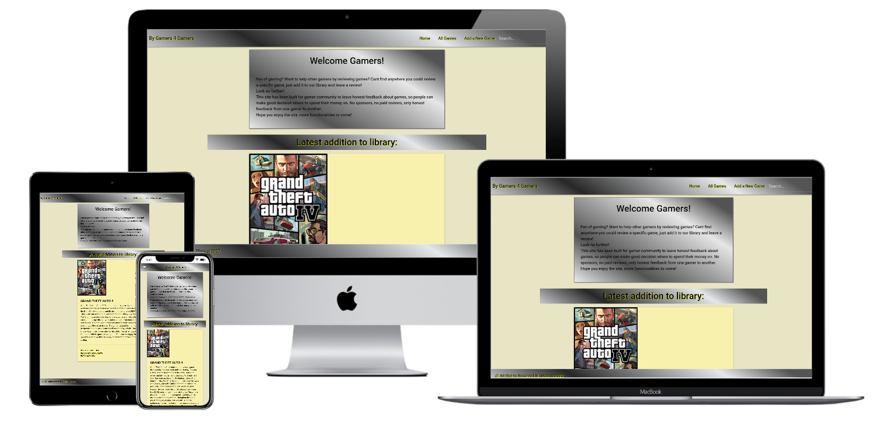

# By Gamers 4 Gamers

As a fan of gaming i decided to great a review site for video games, where users can review and leave rating to games, update content by other users if they find mistakes, add new games when there are some that are missing. The idea is that games are very expensive now a days and any honest feedback is useful before making a purchase decision. Personal goal for the project was, in addition to provide an honest gamer to gamer platform,  to develop my skills in Python programming and working with Mongo database.

Live website can be accessed: https://ms3-project.herokuapp.com/

## Project Goal

* Create a site for anyone who loves gaming and is looking for something to play but wants to make sure to make the best decision where to spend their money
* Have a place where gamers could leave honest reviews to other users, provide links where the game could be purchased 
* Provide a possibility to rate games and then make the average rating available to gamers.
* Provide an easy to use experience

## User Stories for the site

* As a gamer, i want to get honest information about games that is not purchased by the developers so that i can buy only the best games.
* As a gamer, i want to be able to leave reviews for other people so that they can get an overall understanding of the games strengths/weaknesses
* As a gamer, i want to leave a rating for a game so that other people can understand if the game is good or not.
* As a gamer, i want to see ratings from other users so that i can understand what people generally think of a game.
* As a gamer, i want to read reviews from other users so that i can understand what people generally think of a game.
* As a gamer, i want to be able to add games if there is something i feel should be reviewed but i cannot find it in the library.
* As a gamer, i want to be able to search for games so that i could easily find what i am interested in, or i could add a game if i cannot find it by searching.
* As a site owner i want to provide gamers with a site that provides honest information about games, which is not determined by how much anyone invests in the site
* As a site user i want to provide users with a simple to use site to add games and reviews.
* As a site owner i want to provide a free of charge page for users that they can trust as the content is added by the users themselves

## Design 

The design and choice of colors for the site was determined by ease of use. Goal was to provide easy to read, and easy to use site that works well across platforms and is simple and clean in design. 

Color design aims to provide a strong contrast between the navbar and footer and the background color while keeping an smooth design that is easy on the eye. Content background color is a stronger color to highligh the card with content.

Navbar and Footer colors: 

        background: rgb(196, 196, 198);
        background: linear-gradient(31deg, rgba(196, 196, 198, 1) 1%, rgba(39, 39, 40, 1) 27%, rgba(229, 231, 232, 1) 71%, rgba(84, 84, 84, 1) 91%);

Body background:

        background-color: #E8E5C5;

Content background, provides background color for all game content:

        background-color: #E8E5C5;

Font - across the project same font type has been used for consistency across pages:

        font-family: 'Roboto', sans-serif;

### Wireframes 

I used Balsamiq to create the wireframes, some changes were made to the original wireframes in the process of building the project to provide a cleaner and simpler user experienct. For example page for All Games was changed to display games one on top of the other instead of using the original plan of using a grid to have the games 2 X 2 on top of each other.

## Database 

For this project MONGO Database has been used to store information about games and reviews from users. Two separate databases have been created for games and reviews to be able to scale up in the future and to try to keep the project as efficient as possible.

### Reviews Collection

Reviews collection stores the reviews, ratings and username from the user who left the review, it is a simple collection that will be extended as the project developes in the future.

Key | Type 
------------ | -------------
game_name   | String
user_name   | String
review_name   | String
rating   | String

### Games Collection

Game collection stores the games and details about games, for ease of use to add new data the collection has been kept simple but will grow in complexity as the project developes.

Key | Type 
------------ | -------------
game_name   | String
image_link   | String
purchase_link   | String
game_summary   | String

## Features

### Base.html 

Base.html which provides the base for all pages to build upon has the following features implemented:

Navbar:

* Home that redirects to homepage
* All Games redirects to page where all games can be viewed
* Add a New Game redirects users to a form wher new games can be added
* search functionality that allows users to search games from the library

### Homepage 

Homepage card displayes the latest addition to games library, users who add a new game are redirected to homepage where they can see the game they added and from the go and leave a review.

#### Future features for homepage

In the future a plan to add average score to homepage and create a card functionality that displays 5 top rated games.

### All Games page 

All Games page retrieves all games from collection and displayes them 5 at a time on a page, pagination has been used to limit games to 5 per page as that makes the information easier to consume.

#### Future features for All Games page

In the future plan to sort the games based on alphabetical order instead of the current ordering which displayes oldest additions first.

### Add a new game page 

Provides a form where users can add new games that they cannot find from the existing library of games. It is a simple to use form that inserts data to mongodb.

#### Future features for Add new Game page

This page will develop in line with new functionalities and data needed to implement new functionalities. Some of the features could be to drag-drop image instead of providing a link, add reviews at the same time as new games are added etc. 

### Game details (read and leave reviews)

This page provides all the details about a game that have been stored in reviews and games database. For example in this page you can read all the reviews, see the ratings and also see an average rating for the game. Also you can buy this game via a link provided by users and edit information if there is wrong info/details about the game.

#### Future Features for game details 

Would be to include a video/trailer for the game, more details about when the game has been released, who has made it etc. Also to provide a link to purchase game where site owner could get a percentage of sales to make the site sustainable without advertisement.

### Add Reviews

Users can leave reviews and ratings about a game, the game name is prefilled as the user can access this page only via game details page. The form is simple to use and inserts the data into mongodb reviews collection.

#### Future features for Add reviews

This page will develop in line with new functionalities and data needed to implement new functionalities. In the future user could create a user profile for the site and then if logged in username would be prefilled etc. 

### Search results page

Displayes all games that fit the search criteria.

## Technologies / Tools / Languages

* HTML
* CSS 
* JQuery
* Python 
* Materialize
* Jinja 
* Flask 
* Pymongo
* Google fonts

## Testing

This site has been thoroughly tested, all testing has been done manually and no automated testing has been performed. During building of this site Google Chrome Dev Tools have been used extensively to ensure that the site functions well across different screen sizes. 

### Browsers 

This site has been tested and confirmed functioning on the following browsers:

* Edge
* Chrome
* Safari
* Mozilla

### Devices

With help from external users this site has been tested and confirmed functioning:

* Iphone X 
* Iphone XR 
* Samsung Galaxy S9
* Samsung Galaxy A10 
* Ipad 
* Macbook Pro
* HP Elitebook

### Validators

Code has been validated via:

https://jigsaw.w3.org/css-validator/validator   --> No errors returned 
  
http://pep8online.com/checkresult   --> All returned errors removed and now code is error free

https://validator.w3.org/  --> duplicate ID error not removed to ensure functioning search function on both mobile and desktop devices

### Testing of functionalities

All functionalities provided by the site have been thoroughly tested to ensure that users do not run into any errors when using the site.

#### Add New Game 

10-15 different games have been manually added and all errors received during development have been fixed. After new game added that game is shown on the home page as latest addition as per functionality. Duplicate check ensures that no 2 games with identical names could be added.

Known issues:

No verification if link provided by user is a real link or just a string, this check would be added at a later stage.
Duplicate check does not take into consideration potential mispellings or different whitespaces 

#### Review a game 

Many reviews added manually on different devices and via different browsers, without any major errors remaining that would not allow submition of project.

#### Average rating

Average rating functionality tested by reviewing games and leaving different ratings, verification of correct average score returned has been done manually and has been correct each time.

#### Edit game

Edit game functionality working as planned, has been checked by editing 3 different games.

#### All games and pagination

Manually verified that on the all games pages each and every game that has been added to library can be seen. Pagination functionality works as planned and shows only 5 per page. 

Know Errors:

No known errors but major improvement possibilites, read more from future features. 

#### Search functionality

Search functionality has been tested on mobile and desktop devices and works as designed. Search function succesfully matches full words and returns games that match in the search_result page from where further actions can be taken.

Known errors:

Not really and error but search does not match partial words as the current function has been designed that way. In the future there is room to improve this. 

#### Accessing database 

No errors in retrieving or posting date to/form mongodb is left after project has been submitted. All errors have been removed during coding of the site.

#### ** Overall verdict from testing of functionalities **

Even though there are shortcomings in the functionalities and some aspects that could be improved, I believe as the owner of the site that this has been tested substantially and all functionalities are good enough to submit this page as a minimum viable product and to ensure that time to market is also considered before deciding to postpone the project in order to add or fine tune some of the short comings. 

## Deployment

This project development has been done by using VSCode and code repository is on GitHub. The produciton site has been deployed on Heroku.

### Cloning this site

* Site source code can be cloned from : https://github.com/teppm/MS3-Project

* Use input --> git clone https://github.com/teppm/MS3-Project  

* Ensure that you have Python,  PIP and Git installed. If not do that before cloning the project.

* Once source code has been cloned install all required extensions from requirements.txt with input pip -r requirements.txt

### Deploying this site on heroku

* Logged in to heroku with my existing username and password
* From dashboard.heroku.com clicked 'new'
* Chose 'Creat New App'
* Chose a name for the that has not been used before (heroku will inform if the app name is okay to use or not)
* In VScode (as my choice of IDE) i created a Procfile for my repository
* Ensured the spelling of Procfile to be exactly the way it is intended
* Ensured that Encoding for Procfile is UTF-8 , due to having had errors with deployment when it has been UTF-16
* On the heroku page i had been redirected to my new app page automatically 
* On this page is selected 'Settings' 
* On the settings page i clicked 'Reveal Config VARS'
* I filled in config VARS as below (these steps can differ for example if you need to add secret Key or not):

Key | Type
------------ | -------------
IP  | 0.0.0.0
POST  | 5000
MONGO_URI   | (mymongouri with password)

* Next is chose 'deploy' from the Navbar
* Deployment method --> Github
* From Github.com i copied my project URL https://github.com/teppm/MS3-Project and connected that to heroku
* Next i chose to manually deploy site
* Once site was deployed succesfully i could acces it by this page: https://ms3-project.herokuapp.com/ or by clicking on 'OPEN APP' button in heroku
* After having ensured that site has been successfully deployed i went back to heroku and under 'deploy' enable automatic deploys

## Credits and acknowledgments

* Materializecss.com from where i have used base code for form, card, navbar and footer.
* stackoverflow.com where i was able to find a lot of help for different problems with during my coding
* All the game developers whose hard work and brilliant games are the basis and soul for this site
* CodeInstitute tutor support for providing assistance when i have felt completely stuck
* CodeInstitute slack channels where i have been able to search for errors and how people have solved different issues
* Friends and Family for helping with testing of the site and providing their inputs
* CodeInstitute mentor Anthony Ngene for his continued guidance and support 

### This site has been created for educational purposes only, site owner can be contacted via github for support or co-operation.

